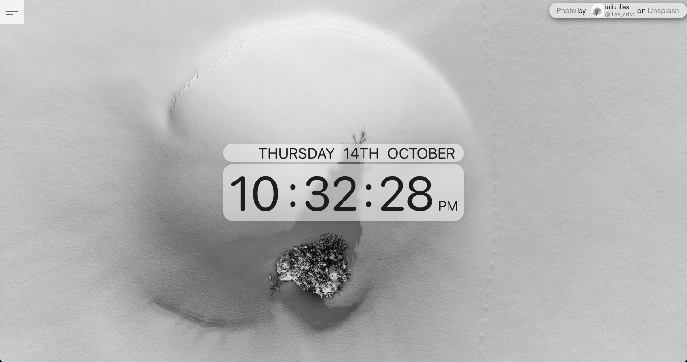
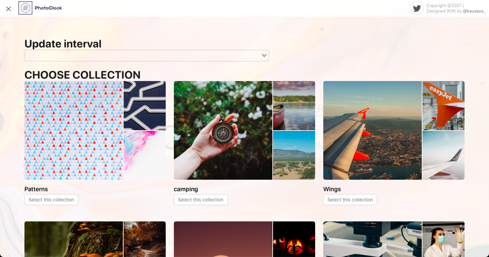

# PhotoClock
Unsplashで取得した画像と時計を表示するだけのアプリ。

## Demo



## App URL

## Features
- 一定時間ごとに背景画像をランダムに更新
- Unsplashの[Collections](https://unsplash.com/collections)にアップロードされた画像からランダムで表示(メニューから選択)
- 自動変更の間隔を変更(メニューから選択)
- PWA:Progressive web appsに対応

## Usage
```sh
$ git clone https://github.com/ur-oot/PhotoClock.git
```
[Unsplash.com](https://unsplash.com/developers)でユーザー登録し、アプリケーションを作成してAPIキーを作成しておく。  
.envファイルのVUE_APP_ACCESS_KEYに以下のようにAPIキーを指定する。
```
VUE_APP_ACCESS_KEY = [APIキー]
```

## Author
Twiiter:[@kausaus_](https://twitter.com/kausaus_)  
Github:[ur-oot](https://github.com/ur-oot)

## License
"PhotoClock" is under [MIT license](https://en.wikipedia.org/wiki/MIT_License).