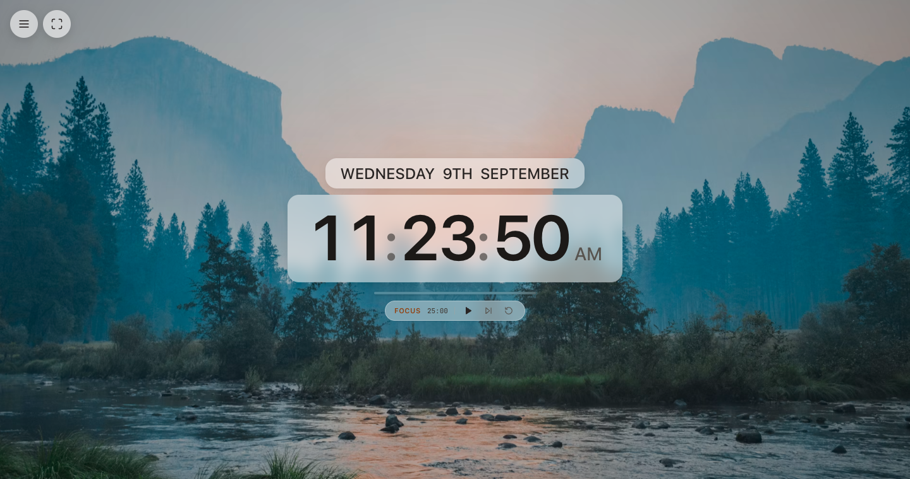
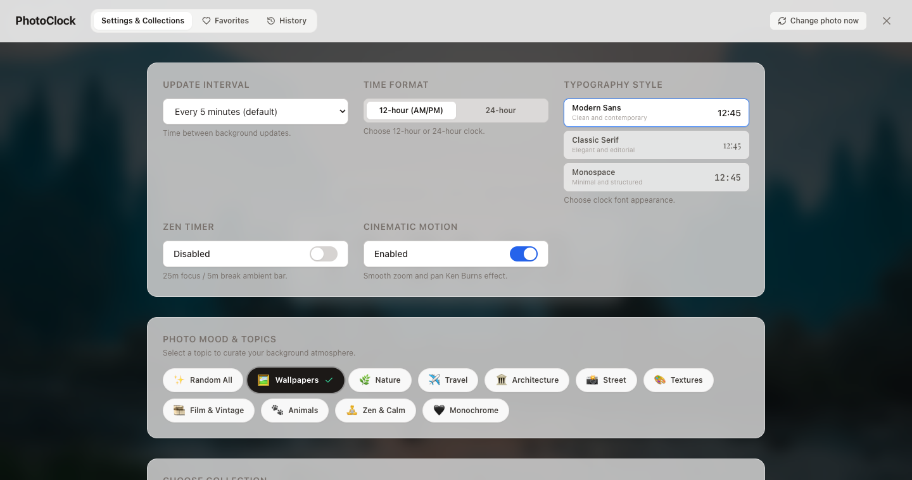

# PhotoClock

Unsplashで取得した高解像度壁紙と時計を表示するミニマルなデジタル時計アプリ。

## Demo



## App URL
https://photoclock.netlify.app

## Features
- **リアルタイム時計表示**: 年・月・日・曜日・12時間制時刻の表示
- **定期的な背景画像更新**: 一定時間ごとに背景画像をランダムに自動更新
- **コレクション指定**: Unsplashの [Collections](https://unsplash.com/collections) から好きなコレクションを選択して表示
- **更新間隔のカスタマイズ**: 3分 / 5分 / 15分 / 30分 / 45分 / 1時間から選択可能（`localStorage` で永続化）
- **APIキー秘匿化**: Netlify Functions (BFF) によるサーバーサイドプロキシ
- **PWA (Progressive Web Apps)**: オフラインキャッシュおよびスタンドアロンインストール対応

## Tech Stack
- **Frontend**: React 19, TypeScript, Vite, Tailwind CSS
- **BFF / Proxy**: Netlify Functions
- **Icons**: Lucide React
- **PWA**: vite-plugin-pwa

## Setup & Local Development

### 1. リポジトリのクローンと依存関係のインストール
```sh
git clone https://github.com/ur-oot/PhotoClock.git
cd PhotoClock
npm install
```

### 2. 環境変数の設定
[Unsplash Developer](https://unsplash.com/developers) でアプリケーションを登録し、Access Keyを取得します。  
`.env` ファイルを作成し、以下のように設定します。

```env
UNSPLASH_ACCESS_KEY=your_unsplash_access_key
```

### 3. ローカル開発サーバーの起動
Netlify Functions と Vite 開発サーバーを同時に立ち上げて本番同等の環境で動作させる場合：

```sh
npx netlify dev
```

※ フロントエンドのみを起動する場合は `npm run dev` で起動可能です（Unsplash APIの取得には Netlify Functions の動作が必要です）。

### 4. ビルド
```sh
npm run build
```

## Production Deployment (Netlify)
Netlify の管理画面（Site configuration > Environment variables）にて、以下の環境変数を設定してください。

| キー名 | 説明 | スコープ |
| :--- | :--- | :--- |
| `UNSPLASH_ACCESS_KEY` | Unsplash API Access Key | Functions / All |

## License
[MIT License](https://en.wikipedia.org/wiki/MIT_License)